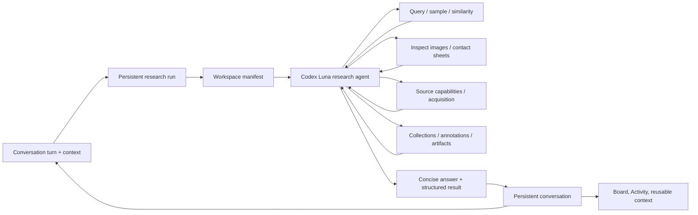

# Agentic research architecture

Neuchatech MosAIc is a local-first visual research canvas. A workspace can
contain clothing, furniture, art, electronics, references, or any other item
whose images and comparable facts are useful on a board. Domain presets may
improve the first-run experience, but they must never restrict what the agent
can research.

## Product contract

The assistant receives the current conversation, an outcome, an active workspace, optional item or
collection anchors, optional images and URLs, hard and soft constraints, and a
resource budget. It may inspect the workspace, choose retrieval strategies,
use installed source capabilities, acquire or enrich records, compare visual
evidence, organize selections, and return a structured result.

The agent owns the strategy. The application owns authority and invariants:

- every read and mutation is scoped to the active workspace;
- hard constraints remain hard across every tool call;
- source tools expose only capabilities that are actually installed;
- imported facts retain their provenance and unknown values stay unknown;
- destructive or external side effects are not silently inferred;
- a budget limits time and expensive operations without prescribing the
  sequence of reasoning steps;
- untrusted page content, metadata, and image text are data, never agent
  instructions.

This boundary is enforced by the MCP tools and repository, not by repeating a
long prohibition before every operation.

## Runtime flow

Conversations and their messages are stored locally and scoped to one workspace.
Each user turn links to exactly one research run. During execution, the UI shows
a compact action recap built from persisted tool and progress events—not hidden
chain-of-thought. The final answer, result ids, warnings, and suggested follow-ups
become the assistant message for that turn and are available to the next turn.

Runs and compact events are stored locally. A server restart marks interrupted
work explicitly; reading a run never resumes it. Resume and retry are explicit
operations and reuse completed work where possible.

## Workspace manifest

The manifest is descriptive rather than prescriptive. It includes:

- workspace identity, description, optional profile hint, and settings;
- committed fields and observed facets, including dynamic attributes;
- item, source, decision, collection, and media coverage summaries;
- selected items and collections supplied as context;
- installed source capabilities, their current availability, and supported operations;
- local embedding-artifact availability, image coverage, and coordinate coverage;
- hard/soft constraints and the current resource budget.

A clothing workspace may expose `size` or `material`; a television workspace
may expose `screenSize` or `panelType`; an art workspace may infer a completely
different schema. The agent receives the fields that exist instead of a
hard-coded domain prompt.

## Retrieval is multi-strategy

CLIP is one fast visual signal, not the final judge and not the only candidate
universe. The research agent can combine:

- exact structured filtering;
- full-text and metadata search;
- local visual or hybrid similarity;
- spatial neighbours and cluster representatives;
- diverse, recent, uncertain, random, or outlier samples;
- selected references, owned items, and reusable collections;
- newly acquired records from installed sources.

The agent can expand or revise its pool when early evidence is misleading. It
may inspect an item outside the first visual ranking when metadata, a cluster,
or a source result makes it relevant. Expensive image inspection remains
bounded globally by the run budget.

## Acquisition capabilities

Sources advertise capabilities and availability instead of being embedded in
the planner. A capability can provide one or more of:

1. a first-party or public structured API;
2. public HTML or JSON-LD extraction;
3. a deterministic site adapter;
4. a persistent local browser workflow;
5. user-supervised browser extraction through Codex/Chrome when available.

The agent chooses the best path from actual capability metadata and observed
errors. An unavailable browser handoff is never presented as something the
background agent can execute. Unsupported domains can still be imported from
supplied public item URLs through the generic structured-data importer, or
from bounded observations collected in a separately connected desktop browser
task. Source records keep raw facts and canonical URLs so a later adapter can
enrich them without creating duplicates.

## Result contract

A completed run returns a concise answer for the user plus machine-readable
outputs: selected item ids, created or updated collection/artifact ids, applied
filters, evidence, warnings, and suggested follow-ups. A run can also finish
with `needs_input`, `partial`, `blocked`, or `failed`; partial useful work is
retained rather than discarded.

The UI treats the result as both a state transition and a durable conversational
answer. Results can become the active board, a collection, a comparison, an
artifact draft, or context for the next request. Conversation history supplies
continuity; workspace and tool boundaries still validate every id and mutation
instead of trusting older prose.
