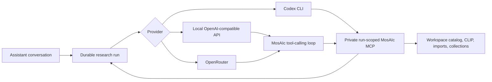

# AI providers

MosAIc has one durable research runtime and three interchangeable inference
providers. Provider choice changes where model inference runs; it does not
change workspace isolation, budgets, persisted events, or the available MosAIc
tools.

## Codex

Codex remains the default and uses the existing local CLI login. The app starts
an ephemeral, read-only Codex run with a private MCP server scoped to one
research run and workspace.

Quick setup:

1. Install and authenticate the official [Codex CLI](https://learn.chatgpt.com/docs/codex/cli).
2. Clone MosAIc, run `npm install`, and start it with `npm run dev`.
3. Open AI settings in the MosAIc composer and select **Codex**.
4. For foreground Codex tasks, run `/mcp` from the repository and confirm the
   project-scoped `mosaic` server is connected. The checked-in
   `.codex/config.toml` supplies that configuration; the official
   [MCP guide](https://learn.chatgpt.com/docs/extend/mcp) explains how project
   MCP configuration is loaded.

```bash
MOSAIC_AI_PROVIDER=codex
MOSAIC_CODEX_MODEL=gpt-5.6-luna
```

## Local OpenAI-compatible inference

The local provider works with LM Studio and other servers that implement
OpenAI-compatible `POST /v1/chat/completions` function calling. The endpoint is
restricted to loopback so a setting named "local" cannot silently transmit a
workspace over the network.

[LM Studio](https://lmstudio.ai/docs/developer/openai-compat/tools) setup:

1. Install LM Studio and start its server from **Developer**, or run
   `lms server start`.
2. Load a model with reliable native tool use.
3. Copy `.env.example` to `.env` and set the exact model identifier shown by
   LM Studio.
4. Restart `npm run dev`, open the assistant, and choose **Local API**.

```bash
MOSAIC_AI_PROVIDER=local
MOSAIC_LOCAL_AI_BASE_URL=http://127.0.0.1:1234/v1
MOSAIC_LOCAL_AI_MODEL=your-loaded-model-id
MOSAIC_LOCAL_AI_VISION=1 # only for a model that accepts image_url input
```

An API key is normally unnecessary for loopback LM Studio. If another local
server requires one, set `MOSAIC_LOCAL_AI_API_KEY`.

Small models can technically emit tool calls but may be unreliable across a
long research run. Prefer a model explicitly trained for tool use. Before
launching MosAIc, verify that `http://127.0.0.1:1234/v1/models` lists the exact
model ID you configured. MosAIc validates the final result and asks the model
to correct invalid structured output up to three times before failing
truthfully.

## OpenRouter

The simplest setup is inside MosAIc:

1. Open the assistant and select **AI settings**.
2. Select **Connect OpenRouter** and authorize the local app.
3. Choose one of the models that advertises tool calling.

MosAIc uses OpenRouter's PKCE S256 flow. The resulting user-controlled key is
stored only by the local API in `data/secrets/openrouter.json` with owner-only
file permissions. The key is never returned to the browser or committed to
Git. Localhost callbacks are supported on any port.

For managed installations, environment variables remain available and take
priority over the UI-managed connection:

```bash
MOSAIC_AI_PROVIDER=openrouter
OPENROUTER_API_KEY=...
MOSAIC_OPENROUTER_MODEL=provider/model-id
```

Optional attribution headers:

```bash
MOSAIC_OPENROUTER_SITE_URL=https://github.com/your-name/mosaic
MOSAIC_OPENROUTER_APP_NAME=Neuchatech MosAIc
```

OpenRouter receives the model prompt and bounded tool results, but it never
receives database credentials or unrestricted filesystem access. MCP tools are
executed locally and remain scoped to the active workspace. When the selected
model advertises image input, images explicitly attached to the request and
visual evidence explicitly requested by the agent are sent as native
multimodal inputs.

The model picker loads `GET /api/v1/models?supported_parameters=tools` from
OpenRouter and excludes models that do not advertise function calling. Model
availability, pricing, and provider behavior can still change upstream.

## Runtime flow



The UI remembers the provider selection locally. **Automatic** uses
`MOSAIC_AI_PROVIDER`, falling back to the first configured provider. API keys
are never returned by `/api/ai/providers` or stored in the browser.

## Research depth and graceful completion

The composer exposes three provider-independent budgets:

- **Quick** for a small, focused answer with a short deadline and few tool calls.
- **Balanced** for normal research, comparisons, imports, and visual retrieval.
- **Deep** for wider discovery, slower local models, or multi-stage research.

Each preset is a hard envelope around elapsed time, tool calls, inspected
items, images, acquisition jobs, imported items, and collection writes. The
selected reasoning mode and remaining allowance are included in the model's
instructions so it can plan accordingly. As a run approaches its limit,
MosAIc removes unavailable tools and gives the model one final tool-free turn
to summarize verified results instead of ending with an avoidable budget
error. The server still validates the final structured result and never turns
an unfinished action into a false success.

## Compatibility contract

An OpenAI-compatible provider must support:

- `POST /v1/chat/completions`;
- `tools` with JSON-schema function definitions;
- assistant `tool_calls` and `tool` result messages;
- enough context for the workspace manifest and relevant tool results.

Use a model with native tool calling. Image input is optional for text-only
research, but required when you attach reference images and expect the model
itself to inspect them. Local CLIP can still retrieve visually similar catalog
items without sending those images to a remote model.

Codex receives explicitly attached references through its native image input.
OpenRouter does the same when its model metadata advertises the `image` input
modality. A local OpenAI-compatible server enables native images with
`MOSAIC_LOCAL_AI_VISION=1`, because that capability is not standardized by all
local `/v1/models` implementations. Vision-capable providers may also receive
images or contact sheets returned by scoped MosAIc tools. Otherwise the run
keeps local CLIP retrieval; if neither native input nor a local CLIP index is
available, MosAIc rejects the image request immediately and explains how to
recover.
